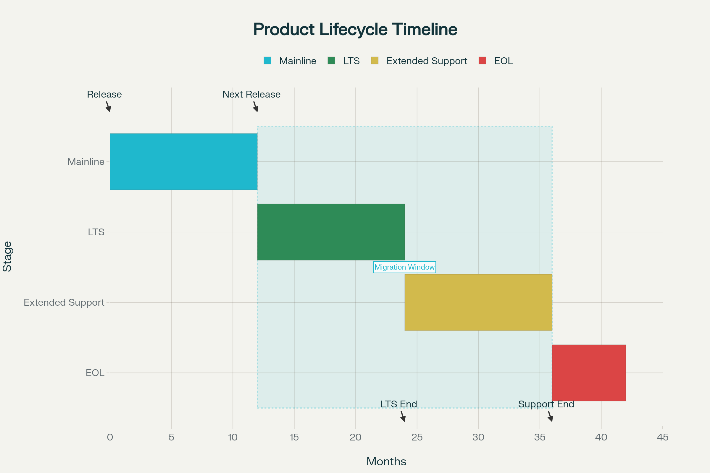

# Product Lifecycle

Our products, especially software, go through different stages during their lifetime. To make this process straightforward, we follow a clear lifecycle strategy. Each time a new release (a new minor or major version) is published, it becomes the active development line—we call this the Mainline. The previous version then moves into Long Term Support (LTS), where it continues to receive bug fixes for a limited time. Eventually, products reach End of Life (EOL), which means support for them ends.

## Mainline Version (ML)

The Mainline is the most current version of a product. It’s the version we actively develop, enhance, and maintain. All new features, improvements, and components are added here. As a new customer, you’ll always receive the latest mainline version. Ordering of one of the following products/services is always for the latest mainline version:

 * [OPC UA Client .NET](https://technosoftware.com/product/opc-ua-client-net/)
 * [OPC UA Server .NET](https://technosoftware.com/product/opc-ua-server-net/)
 * [OPC UA Bundle .NET](https://technosoftware.com/product/opc-ua-bundle-net/)
 * [OPC UA Support Subscription](https://technosoftware.com/product/opc-ua-support-subscription/)

## Long Term Support (LTS)

When a new mainline release comes out, the version just before it enters Long Term Support (LTS). For example, if version 4.0.0 is released, the 4.0.x series becomes the mainline, while the latest 3.x.x moves into LTS.

During the LTS phase:

 * No new features are added
 * Bug fixes are provided if needed
 * The standard LTS period lasts one year (365 days) starting from the release of the next mainline version
	
This gives customers with a valid [OPC UA Support Subscription](https://technosoftware.com/product/opc-ua-support-subscription/) at least one year of transition time to update your application.

Customers with a valid [OPC UA Support Subscription](https://technosoftware.com/product/opc-ua-support-subscription/) at the time a version enters the LTS phase can request support and/or bug fixes for the LTS version. All other customers needs to upgrade to the MLS first. 
New purchases of a [OPC UA Support Subscription](https://technosoftware.com/product/opc-ua-support-subscription/) are always for the MLS.

If you need more time, we also offer Extended Support for up to an additional year. This option includes bug fixes but no new features and is available upon request (usually with an additional fee).

## End of Life (EOL)

When a product’s LTS period ends, it enters End of Life (EOL). From that point on, no further updates, fixes, or support are provided.

If your application relies on a version that is nearing EOL, we strongly recommend upgrading to the latest mainline release. If upgrading is not possible, you may choose the source code edition of the [OPC UA Bundle .NET](https://technosoftware.com/product/opc-ua-bundle-net/) product, which allows you to maintain and fix it yourself.