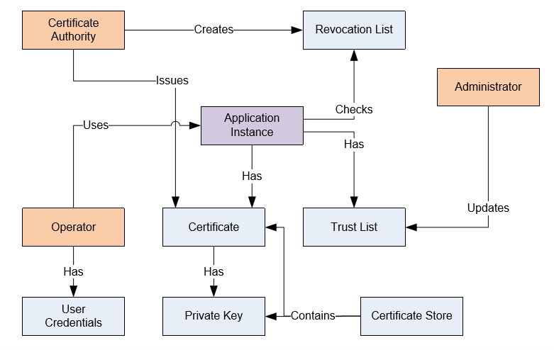

# Security

This chapter is based on the [Whitepaper The OPC UA Security Model for Administrators, Version 1.00 from July, 2010](https://opcfoundation.org/wp-content/uploads/2014/05/OPC-UA_Security_Model_for_Administrators_V1.00.pdf) and should be used as reference. 

## Background

A security model is an architecture that allows developers, administrators and end users to use applications in a distributed environment while ensuring that the applications, the computers they run on, and the information exchanged is not compromised.  A complete security model has several facets including application security, transport security, user authorization and authentication and traceability.  This white paper describes how to use the OPC UA security model to ensure application and transport security. The target audience for this document are systems administrators and end users. A second whitepaper will discuss the security model from the perspective of a software developer. 

The OPC UA security model has been designed to meet the requirements of many different systems while using the same infrastructure. To accommodate different security and administrative requirements the OPC UA security model offers four tiers for application authentication and two tiers for certificate management. It is up to the administrator to decide which tiers best match their needs. Applications should support all tiers. This document also discusses the administrative procedures required by a tier. Applications must allow administrators to configure the level of security enforced by their application just like web browsers allow administrators to configure the security level enforced by the browser.

The UA Security Model defines four principal actors: The Application Instance, the Application Administrator, the Application Operator and the Certificate Authority. The relationships between these actors are shown in the following figure. Each of the entities is described in the text that follows.  

### Security Tiers 

#### The Basics 

In OPC UA, each installation of an application must have an application instance certificate that uniquely identifies the application and the machine that it is running on. These certificates come with private keys that allow applications to create secure communication channels that cannot be viewed by 3rd parties or modified while in transit. These certificates also allow OPC UA applications to be identified by peers and to block communication from a peer if it is not authorized.   

#### Tier 1 - No Authentication

In this tier the client and server allow any peer to communicate which means that all valid certificates are trusted. The application certificates are used only to provide unverifiable information about the peer. The receiver has no way to know if the sender is the legitimate holder of the certificate. 

In this mode the client and server automatically accept valid certificates even if they have not been explicitly added to the trust lists managed by the client and server applications. This mode requires no configuration at the server or client. 

This tier cannot ensure the privacy of any information transmitted, including user credentials. This tier would only be appropriate in a system that has guaranteed security in some other manner, such as a physically secured and isolated system or where communications is secured via VPN or other such transport layer security.  It would also be appropriate in a situation where all information is public and access to it is open. 

A developer need only configure an installation procedure that generates an application instance certificate for an application on installation. 

#### Tier 2 - Server Authentication

In this tier the server allows any client to connect and if user authentication is required it is done by sending user credentials such as a username/password after the secure channel has been established. Clients, on the other hand, must be configured by the administrator to trust the Server.  

Clients will trust a Server if an administrator has explicitly placed the Server certificate into its trust list or if the Server's certificate was issued by a CA which is in its trust list. 

If the Server's certificate was not explicitly in the trust list (i.e. the certificate was issued by a CA that is in the trust list) the client should compare the DNS name in the Server's certificate to the DNS name it used to connect to server. If they match the client knows it is connecting to the machine it thinks it is connecting to.  This does not guarantee that the client has connected to correct server, only that the machine is the correct machine.   

This tier is used by most Internet banking applications where the bank's web server has a certificate issued by Certificate Authorities like Verisign which are automatically placed in the browsers trust list by the Windows operating system. It provides a fairly good security, but the server cannot restrict the client applications. 
 
#### Tier 3 - Client Authentication

In this tier the client connects to any server, but the server only allows trusted clients to connect. Clients never provide sensitive information since it does not know if it the server is legitimate. 

In this tier clients need no pre-configuration other than the URL of the server. However, Servers will only trust clients with certificates that have been placed by administrators in the server’s trust list or if the Clients certificate was issued by a CA which is in its trust list 

This mode is used by discovery services which need to ensure that only authorized applications have access to them, but clients don't care if the server is not legitimate. The local discovery server (LDS) operates in this mode and only allows authorized applications to register themselves.

#### Tier 4 - Mutual Authentication

In this tier both the client and server only allow trusted peers to connect. It offers the highest level of security but requires that both the client and server be configured in advance. This is the recommended mode for any public or semi-public deployment of OPC UA or for deployments where security is a primary concern. 

As in Tier 2, clients should check the DNS name if the Server certificate was not explicitly placed in the trust list. 

It will be used in environments where administrators want complete control over which applications can talk to each other. It also provides the most secure environment. 

Application installation should default to Tier 4 mode

## Certificate and Certificate Stores

In general the implementation is based on [OPC 10000-2]. In detail the following is implemented:

### Overview

When working with certificates it is important to understand the formats associated with a certificate and where the certificates are stored. Both the formats and storage location vary from platform to platform and vary by the cryptographic library that is being used by an application.

### Certificates and Private keys

Certificates are typically stored in files that can have several formats.

The formats used by UA applications are shown in the following tables.

| **Format**                                         | **Description**                                                                                                                                                                                                                                                                                                                                                                                  |
|:---------------------------------------------------|:-------------------------------------------------------------------------------------------------------------------------------------------------------------------------------------------------------------------------------------------------------------------------------------------------------------------------------------------------------------------------------------------------|
| DER                                                | An ASN.1 blob encoded with the DER (distinguished encoding rules). File extension is *.der or *.cer on Windows systems. Use only for storing the Certificate (not the Private Key). Certificates can be imported or exported to/from Windows Certificate Stores using this format. It is also the file format used to store a certificate in a directory store.                         |
| PKSC#12                                            | A binary format used to store RSA private keys with their certificates. File extension is *.pfx. May be password protected. Private keys can be imported or exported to/from Windows Certificate Stores using this format.                                                                                                                                                              |
| PEM                                                | A text format used to store private keys File extension is *.pem. May be password protected. This format is only used by some OpenSSL based applications or windows application, but they include items such as CRL lists. Other formats such as *.crt, or *.crl may occur in some systems, but all others can be converted or matched to one of the above, by the operating system  |

Other formats such as *.crt, or *.crl may occur in some systems, but all others can be converted or matched to one of the above, by the operating system.

All required application certificates for OPC UA are created at the first start of each application in a directory or OS-level certificate store and remain in use until deleted from the store.

The OPC UA Solutions .NET allows also using of CA issued application certificates and remote certificate store and trust list management with a *Global Discovery Server* using *Server Push*.

#### Certificate stores

The layout of the certificate stores for sample applications which store the certificates in the file system follow the recommended layout in the [Part 12: Discovery and Global Services](https://reference.opcfoundation.org/v105/GDS/docs/F.1/), where certificates are stored in a `certs` folder, private keys under a `private` folder and revocation lists under a `crl` folder with a `<root>` folder called `pki`. 

The OPC UA Solutions .NET supports the following certificate stores:

 - The **Application** store  
   `<root>/own` which contains private keys used by the application.

 - The **Issuer** store  
   `<root>/issuer` which contains certificates which are needed for validation, for example to complete the validation of a certificate chain. A certificate in the *Issuer* store is *not* trusted! 

 - The **Trusted** store  
   `<root>/trusted` which contains certificates which are trusted by the application. The certificates in this store can either be self signed, leaf, root CA or sub CA certificates. 
   The most common use case is to add a self signed application certificate to the *Trusted* store to establish trust with that application. 
   If the application certificate is the leaf of a chain, the trust can be established by adding the root CA, a sub CA or the leaf certificate itself to the *Trusted* store. Each of the options enables a different set of trusted certificates. A trusted Root CA or Sub CA certificate is used as the trust anchor for the certificate chain, which means any leaf certificate with a chain which contains the Root CA and Sub CA certificate is trusted, but the specification still mandates the validation of the whole chain. For the chain validation any certificate in the chain except the leaf certificate must be available from the *Issuer* store.

   If only the leaf certificate is in the *Trusted* store and the rest of the chain is stored in the *Issuer* store, then only the leaf certificate is trusted. 
   As an example, to trust an application certificate that is issued by a Root CA, only the Root CA certificate is required in the *Trusted* store to establish trust to all application certificates issued by the CA. This option can greatly simplify the management of OPC UA Clients and Servers because only one certificate needs to be distributed across all systems.

 - The **Rejected** store  
   `<root>/rejected` which contains certificates which have been rejected. This store is provided as a convenience for the administrator of an application to allow to copy an untrusted certificate from the *Rejected* to the *Trusted* store to establish trust with that application.

 - The **Issuer User** store  
   `<root>/issuerUser` which contains user certificates which are used to validate user certificates.

 - The **Trusted User** store  
   `<root>/trustedUser` which contains user certificates which are trusted by an application. To establish trust, the same rules apply as explained for the *Trusted* and the *Issuer* store.

 - The **Issuer Https** store  
   `<root>/issuerHttps` which contains https certificates which are used to validate https connection certificates.

 - The **Trusted Https** store  
   `<root>/trustedHttps` which contains https certificates which are trusted by an application. To establish trust, the same rules apply as explained for the *Trusted* and the *Issuer* store.

#### X509Store on Windows

Starting with Version 1.5.xx of the OPC UA Solutions .NET the X509Store supports the storage and retrieval of CRLS, if used on the **Windows OS**.
This enables the usage of the X509Store instead of the Directory Store for stores requiring the use of crls, e.g. the issuer or the directory Store.

#### Windows .NET applications

By default the self signed certificates are stored in a **X509Store** called **CurrentUser\\UA_MachineDefault**. The certificates can be viewed or deleted with the Windows Certificate Management Console (certmgr.msc). The *trusted*, *issuer* and *rejected* stores remain in a folder called **OPC Foundation\pki** with a root folder which is specified by the `SpecialFolder` variable **%CommonApplicationData%**. On Windows 7/8/8.1/10 this is usually the invisible folder **C:\ProgramData**. 

#### Windows UWP applications

By default the self signed certificates are stored in a **X509Store** called **CurrentUser\\UA_MachineDefault**. The certificates can be viewed or deleted with the Windows Certificate Management Console (certmgr.msc). 

The *trusted*, *issuer* and *rejected* stores remain in a folder called **OPC Foundation\pki** in the **LocalState** folder of the installed universal windows package. Deleting the application state also deletes the certificate stores.

#### .NET Core applications on Windows, Linux, iOS etc.

The self signed certificates are stored in a folder called **OPC Foundation/pki/own** with a root folder which is specified by the `SpecialFolder` variable **%LocalApplicationData%** or in a **X509Store** called **CurrentUser\\My**, depending on the configuration. For best cross platform support the personal store **CurrentUser\\My** was chosen to support all platforms with the same configuration. Some platforms, like macOS, do not support arbitrary certificate stores.

The *trusted*, *issuer* and *rejected* stores remain in a shared folder called **OPC Foundation\pki** with a root folder specified by the `SpecialFolder` variable **%LocalApplicationData%**. Depending on the target platform, this folder maps to a hidden locations under the user home directory.

[OPC 10000-1]: https://reference.opcfoundation.org/Core/Part1/v105/docs/
[OPC 10000-2]: https://reference.opcfoundation.org/Core/Part2/v105/docs/
[OPC 10000-3]: https://reference.opcfoundation.org/Core/Part3/v105/docs/
[OPC 10000-3 Annex C]: https://reference.opcfoundation.org/Core/Part3/v105/docs/C
[OPC 10000-4]: https://reference.opcfoundation.org/Core/Part4/v105/docs/
[OPC 10000-5]: https://reference.opcfoundation.org/Core/Part5/v105/docs/
[OPC 10000-6]: https://reference.opcfoundation.org/Core/Part6/v105/docs/
[OPC 10000-7]: https://reference.opcfoundation.org/Core/Part7/v105/docs/
[OPC 10000-8]: https://reference.opcfoundation.org/Core/Part8/v105/docs/
[OPC 10000-9]: https://reference.opcfoundation.org/Core/Part9/v105/docs/
[OPC 10000-10]: https://reference.opcfoundation.org/Core/Part10/v105/docs/
[OPC 10000-11]: https://reference.opcfoundation.org/Core/Part11/v105/docs/
[OPC 10000-12]: https://reference.opcfoundation.org/Core/Part12/v105/docs/
[OPC 10000-13]: https://reference.opcfoundation.org/Core/Part13/v105/docs/
[OPC 10000-14]: https://reference.opcfoundation.org/Core/Part14/v105/docs/