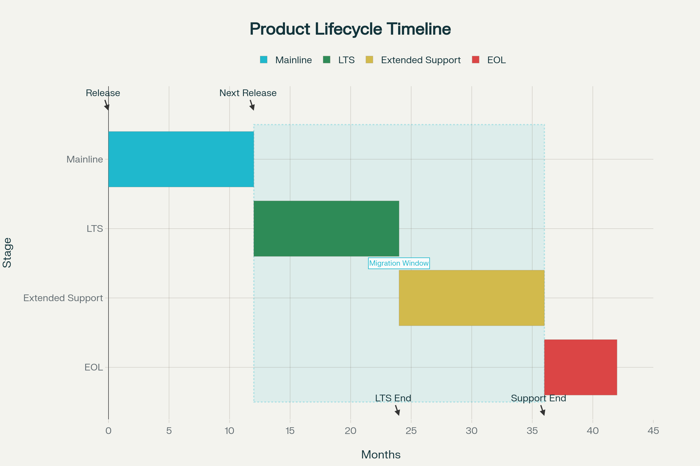

# Product Lifecycle

**Document Control**

| **Version** | **Date**    | **Comment**                          |
|-------------|-------------|--------------------------------------|
| 6.0         | 04-JUL-2026 | Updated to cover version 6.0         |

Our products, especially software, go through different stages during their lifetime. To make this process straightforward, we follow a clear lifecycle strategy. Each time a new release (a new minor or major version) is published, it becomes the active development line—we call this the Mainline. The previous version then moves into Long Term Support (LTS), where it continues to receive bug fixes for a limited time. Eventually, products reach End of Life (EOL), which means support for them ends.

## Support Dates

| **Version** | **Current State** | **Retirement Date**     | **Available Support**                                                           |
|:------------|:------------------|:------------------------|:--------------------------------------------------------------------------------|
| 3.4         | EOL               | 31-MAY-2026             |                                                                                 |
| 4.3         | EOL               | 31-MAY-2026             |                                                                                 |
| 5.0         | LTS               | 31-MAY-2027, In Support | Yes, with a license and valid support subscription                              |
| 6.0         | ML                | In Support              | Yes, with a license (NuGet packages only) and with a valid support subscription |

Version 6 will enter the mainline version phase on 31-MAY-2026.

Version 5 is the current mainline version but will enter the long term support phase on 31-MAY-2026. This version will be supported for customers with license and valid support subscription at least until 31-MAY-2027.

Because of too many breaking changes in the OPC Foundationn stack the following versions can no longer be maintained and are end-of-life from 31-MAY-2026 on:

 * Version 4.x
 * Version 3.4 

It is highly recommended to update to version 5 or 6 now.

## Mainline Version (ML)

The Mainline is the most current version of a product. It’s the version we actively develop, enhance, and maintain. All new features, improvements, and components are added here. As a new customer, you’ll always receive the latest mainline version. The support subscription always includes the latest mainline version.

 * [Get in contact with us](https://technosoftware.com/contact)

### Long Term Support (LTS)

When a new mainline release comes out, the version just before it enters Long Term Support (LTS). For example, if version 6 is released, the 6.x series becomes the mainline, while the latest 5.x moves into LTS.

During the LTS phase:

 * No new features are added
 * Bug fixes are provided if needed
 * The standard LTS period lasts one year (365 days) starting from the release of the next mainline version
	
This gives customers with a valid support subscription at least one year of transition time to update your application.

Customers with a valid support subscription at the time a version enters the LTS phase can request support and/or bug fixes for the LTS version. All other customers needs to upgrade to the ML version first. New purchases of a support subscription are always for the ML version.

## End of Life (EOL)

When a product’s LTS period ends, it enters End of Life (EOL). From that point on, no further updates, fixes, or support are provided.

If your application relies on a version that is nearing EOL, we strongly recommend upgrading to the latest mainline release. If upgrading is not possible, you may request a quote for the source code edition of the solution, which allows you to maintain and fix it yourself.