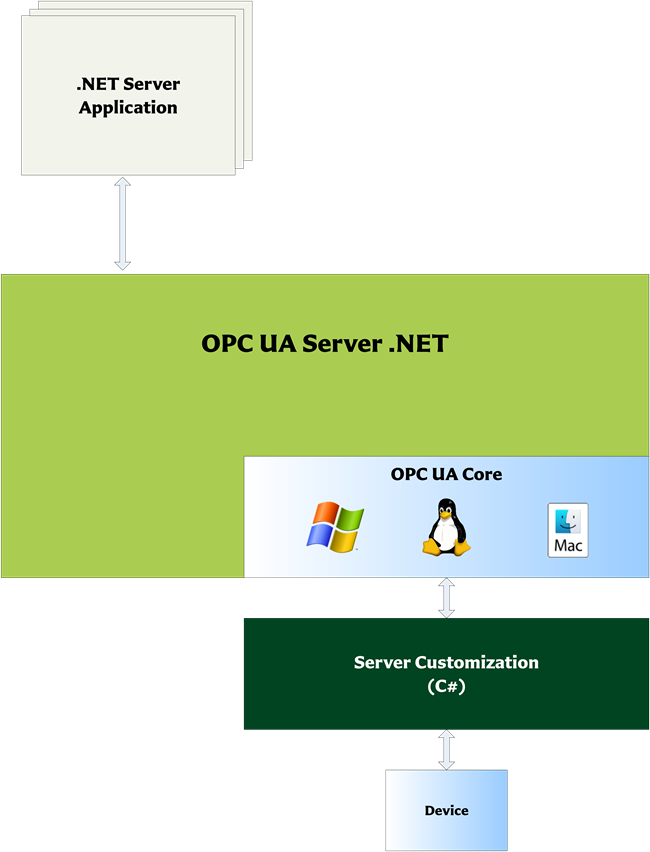

# Solutions

## OPC UA Client

The OPC UA Client .NET  offers a fast and easy access to the OPC Unified Architecture (UA) technology. Develop OPC UA compliant Clients with C# targeting .NET.

.NET allows you develop applications that run on all common platforms available today, including Linux, macOS and Windows 11/10 (including embedded/IoT editions) without requiring platform-specific modifications.

The OPC UA Client .NET API defines classes which can be used to implement an OPC client capable to access OPC servers supporting different profiles with the same API. These classes manage client side state information; provide higher level abstractions for OPC tasks such as managing sessions and subscriptions or saving and restoring connection information for later use.

## OPC UA Server

The OPC UA Server NET offers a fast and easy access to the OPC Unified Architecture (UA) technology. Develop OPC UA compliant Servers with C# targeting .NET.

.NET allows you develop applications that run on all common platforms available today, including Linux, macOS and Windows 11/10 (including embedded/IoT editions) without requiring platform-specific modifications.

The server API is easy to use and many OPC specific functions are handled by the framework. The included Model Compiler can be used to create the necessary C# classes of Information Model’s specified in XML and CSV based files.

