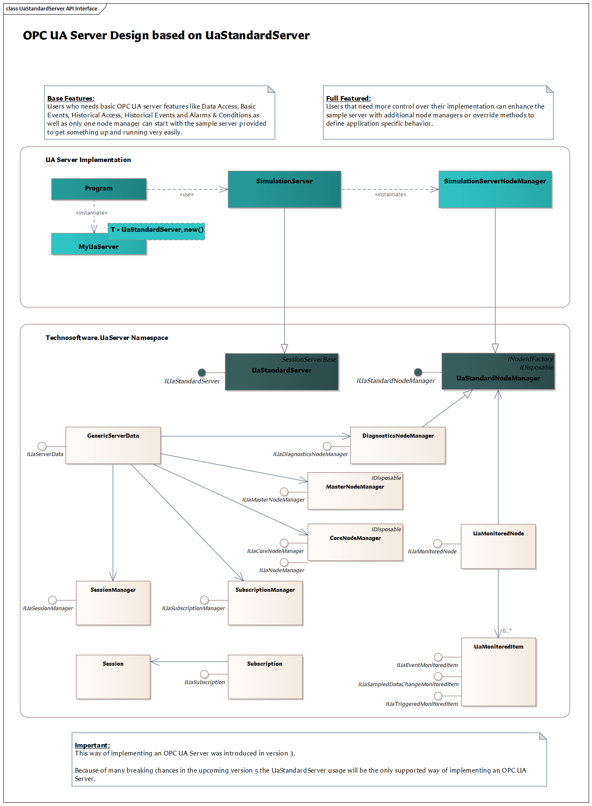
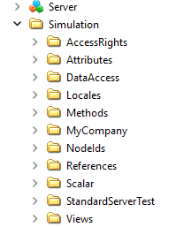

# Server Design

## Overview

We concentrate in this tutorial on the simple *SampleServer*, a console-based application for testing the server specific features. This tutorial will refer to that code while explaining the different steps to take to accomplish the main tasks of an OPC UA server.



The main differences between an OPC UA Server using UaStandardServer compared to UaBaseServer are:

1. It is possible to use several node managers, each handling one node tree under the root tree.
2. No restrictions in which features can be used and modified. 

## Tutorial “OPC UA Sample Server”

This chapter describes how to create your first OPC UA server based on the Simulation SampleServer project. It canb be found in /tutorials/SampleCompany/SampleServer. It shows the basic steps required to adapt one of the examples to your needs. It is highly recommended to follow this tutorial. More detailed topics will be later discussed and base on the sample server created in this chapter.

### Overview

The example OPC UA Server is splitted into two projects, a main project which handles the start and stop of an OPC UA server and a project containing one or more node managers.

The main project at /tutorials/SampleCompany/SampleServer consists at least of the following C\# files:

| **Name**                   | **Description**                                                                                                                                                                                                                                                                                      |
|:---------------------------|:-----------------------------------------------------------------------------------------------------------------------------------------------------------------------------------------------------------------------------------------------------------------------------------------------------|
| Directory.Build.props      | A user-defined file that provides customizations to projects under a directory. In our case it imports the targets.props, common.props and version.props files. You can find them in the root of the repository.                                                                                     |
| targets.props              | A user-defined file that defines for which target the server should be build for. Adapt the following parameter to your needs: \<AppTargetFrameworks\>net9.0;net8.0;net48\</AppTargetFrameworks\> or use the \<AppTargetFramework\>net9.0\</AppTargetFramework\>.                                    |
| common.props               | A user-defined file that defines some common properties used by all samples.                                                                                                                                                                                                                         |
| version.props              | A user-defined file that defines the version via **version.json**.                                                                                                                                                                                                                                   |
| Program.cs                 | Contains the code to startup the OPC UA server.                                                                                                                                                                                                                                                      |
| MyUaServer.cs              | Contains the main class of the UA server and is based on UaStandardServer.                                                                                                                                                                                                                           |
| *.Config.xml               | Contains the configuration of the OPC UA Server, e.g. ApplicationName. For the empty server it is named:   Technosoftware.SampleServer.Config.xml                                                                                                                                                    |

The node manager project at /tutorials/SampleCompany/NodeManagers consists one main node manager, each node manager located within a subdirectory with at least the following C\# files:

| **Name**                   | **Description**                                                                                                                                                                                                                                                                                      |
|:---------------------------|:-----------------------------------------------------------------------------------------------------------------------------------------------------------------------------------------------------------------------------------------------------------------------------------------------------|
| Directory.Build.props      | A user-defined file that provides customizations to projects under a directory. In our case it imports the targets.props, common.props and version.props files. You can find them in the root of the repository.                                                                                     |
| targets.props              | A user-defined file that defines for which target the server should be build for. Adapt the following parameter to your needs: \<AppTargetFrameworks\>net9.0;net8.0;net48\</AppTargetFrameworks\> or use the \<AppTargetFramework\>net9.0\</AppTargetFramework\>.                                    |
| common.props               | A user-defined file that defines some common properties used by all samples.                                                                                                                                                                                                                         |
| version.props              | A user-defined file that defines the version via **version.json**.                                                                                                                                                                                                                                   |
| NodeManagerUtils.cs        | Helper class to find node managers implemented in this library.                                                                                                                                                                                                                                      |

The sample server implements one main node manager in the subdirectory Simulation:

| **Name**                   | **Description**                                                                                                                                                                                                                                                                                      |
|:---------------------------|:-----------------------------------------------------------------------------------------------------------------------------------------------------------------------------------------------------------------------------------------------------------------------------------------------------|
| Namespace.cs               | Constant(s) defining the used namespaces for the node manager, e.g. public const string SimulationServer = "http://samplecompany.com/SampleServer/NodeManagers/Simulation";                                                                                                                          |
| *Server.cs                 | Implements the basic OPC UA Server and overrides the UaStandardServer class. This file is only needed for the main node manager. For the simulation server it is named: SimulationServer.cs                                                                                                          |
| *ServerConfiguration.cs    | Stores the configuration of the node manager. For the simulation server it is named: SimulationServerConfiguration.cs                                                                                                                                                                                |
| *ServerNodeManager.cs      | Implements the OPC UA NodeManager and overrides the UaStandardNodeManager class. For the simulation server it is named: SimulationServerNodeManager.cs                                                                                                                                               |

### Start developing your own OPC UA Server

You need the following files to be able to develop your own OPC UA Server:

1. Copy the directoy with the Sample OPC UA Server at /tutorials/SampleCompany/SampleServer, to your development directory, e.g., /solutions/SampleServer
2. Copy the directoy with the Sample OPC UA Nodemanager at /tutorials/SampleCompany/NodeManagers, to your development directory, e.g., /solutions/NodeManagers
3. Copy /Directory.Build.props and /targets.props to /solutions
4. Rename the folder to your needs.

In the following chapters you will find some required and recommended changes necessary before you start changing the source code. For a first OPC UA Server we recommend changing only those values and keep everything else untouched. As you proceed further with this tutorial more and more changes and enhancements are done.

#### Renaming files

It is a good idea to rename several files to fit your project. As mentioned in the last chapter we use a general naming of files and namespaces and for this tutorial we defined it as:

Company: SampleCompany   
Server Namespace: SampleServer  
Namespace: SampleCompany.SampleServer and SampleCompany.NodeManagers

Of course, you can replace the company name with your company name and the server namespace with a more usable one for your project.

Please change the names of the following files:

1. SampleCompany.SampleServer.Config.xml
2. SampleCompany.SampleServer.csproj

In this tutorial we just use the same file names.

#### Changes to project and building options

1. Please open the SampleCompany.SampleServer.csproj file with Visual Studio 2022.
2. Replace SampleCompany.SampleServer in all your project files.
3. Check the project properties Package dialog or edit the SampleCompany.SampleServer.csproj file and adapt the following entries: \<Company\>, \<Product\>, \<Description\> and \<Copyright\>
4. The SampleCompany.SampleServer.csproj file use \$(AppTargetFrameworks) for the targets it should build for. That one is defined in the targets.props file.

#### Changes in SampleCompany.SampleServer.Config.xml

1. Open the SampleCompany.SampleServer.Config.xml file with Visual Studio 2022.
2. The values of the following global parameters changes must at least be changed:
    - \<ApplicationName\>SampleCompany OPC UA Sample Server\</ApplicationName\>
    - \<ApplicationUri\>urn:localhost:SampleCompany:SampleServer\</ApplicationUri\>
    - \<ProductUri\>uri:samplecompany.com:SampleServer\</ProductUri\>
3. In the section \<SecurityConfiguration\>\<ApplicationCertificate\> you need to define the Subject name for the application certificate.
    - \<SubjectName\>CN=SampleCompany OPC UA Sample Server, C=CH, S=Aargau, O=SampleCompany, DC=localhost\</SubjectName\>
4. In the section \<ServerConfiguration\> you need to define the URL the server should be reachable. One entry is for the opc.tcp protocol and one for the https protocol:
    - \<ua:String\>opc.tcp://localhost:62555/SampleServer\</ua:String\>
    - \<ua:String\>opc.https://localhost:62556/SampleServer</ua:String\>

#### Program Customization

The Program.cs file contains the startup of the application and the OPC UA Server. The important part related to OPC UA are:

**Using statements:**

```
    using Opc.Ua;
    using Technosoftware.UaUtilities;
    using SampleCompany.Common;
    using SampleCompany.NodeManagers;
```

**The application name and config file name:**

```
    const string applicationName = "SampleCompany.SampleServer";
    const string configSectionName = "SampleCompany.SampleServer";
```

Please ensure that the application name and config section name fits your configuration file name, in the example SampleCompany.SampleServer.Config.xml.

**Starting the server:**

The UA server handling itself can be found in *MyUaServer.cs* which will be explained later, in Program.cs just the creation, configuration, certificate checking, creating and adding the node manager(s), start and stop of the server is done. 

First the server must be created, for this the MyUaServer class uses the reference to the server class which must be based on [UaStandardServer class](../api/Technosoftware.UaServer.UaStandardServer.yml), in the sample it is the SimulationServer class:

```
    // create the UA server
    var server = new MyUaServer<NodeManagers.Simulation.SimulationServer>(output)
    {
        AutoAccept = autoAccept,
        Password = password
    };
	
    // load the server configuration, validate certificates
    output.WriteLine("Loading configuration from {0}.", configSectionName);
    await server.LoadAsync(applicationName, configSectionName).ConfigureAwait(false);

    // setup the logging
    ConsoleUtils.ConfigureLogging(server.Configuration, applicationName, logConsole, LogLevel.Information);

    // check or renew the certificate
    await output.WriteLineAsync("Check the certificate.").ConfigureAwait(false);
    await server.CheckCertificateAsync(renewCertificate).ConfigureAwait(false);
```

The NodeManagerUtils class is a helper class to get all implemented Node Managers in a library by reflection. If you only have one manager this is not used because the main nodemanager is created in the overriden method CreateMasterNodeManager, in the sample this is done in CreateMasterNodeManager.

The usage of more then one node manager is explained later in this chapter. In the example it looks like:

```
    // Create and add the node managers
    server.Create(NodeManagerUtils.NodeManagerFactories);

    // start the server
    await output.WriteLineAsync("Start the server.").ConfigureAwait(false);
    await server.StartAsync().ConfigureAwait(false);

    await output.WriteLineAsync("Server started. Press Ctrl-C to exit...").ConfigureAwait(false);

    // wait for timeout or Ctrl-C
    var quitCts = new CancellationTokenSource();
    ManualResetEvent quitEvent = ConsoleUtils.CtrlCHandler(quitCts);
    bool ctrlc = quitEvent.WaitOne(timeout);

    // stop server. May have to wait for clients to disconnect.
    await output.WriteLineAsync("Server stopped. Waiting for exit...").ConfigureAwait(false);
    await server.StopAsync().ConfigureAwait(false);	
```

#### MyUaServer Class

The MyUaServer class is a template cincluding some basic functionality needed for the startup phase of an OPC UA server.

#### Server class based on the UaStandardServer

The SimulationServer class is based on the [UaStandardServer class](../api/Technosoftware.UaServer.UaStandardServer.yml) and overrides several methods. The most used ones are:

- CreateMasterNodeManager
- CreateMonitoredItemQueueFactory
- CreateSubscriptionStore
- CreateResourceManager
- OnServerStarting
- OnServerStarted

but also several from the ServerBase class of the OPC UA Stack itself:

- LoadServerProperties
- GetUserTokenPolicies

#### Node manager class based on the UaStandardNodeManager

The SimulationServerNodeManager class is based on the [UaStandardNodeManager class](../api/Technosoftware.UaServer.UaStandardNodeManager.yml) and overrides several methods. The most important one is createing the address space:

- CreateAddressSpace

#### Using more than one Node manager

Using more than one node namager is easy, for each node manager you have to implement an additional class based on the [IUaNodeManagerFactory](../api/Technosoftware.UaServer.IUaNodeManagerFactory.yml), e.g.:

```
    /// <summary>
    /// The node manager factory for test data.
    /// </summary>
    public class DataTypesServerNodeManagerFactory : IUaNodeManagerFactory
    {
        /// <inheritdoc/>
        public IUaNodeManager Create(IUaServerData server, ApplicationConfiguration configuration)
        {
            return new DataTypesServerNodeManager(server, configuration, NamespacesUris.ToArray());
        }

        /// <inheritdoc/>
        public StringCollection NamespacesUris
        {
            get
            {
                var nameSpaces = new StringCollection {
                    Namespaces.SampleDataTypes,
                    Namespaces.SampleDataTypes + "Instance"
                };
                return nameSpaces;
            }
        }
    }
	
    /// <summary>
    /// A node manager for a server that exposes several variables.
    /// </summary>
    public class DataTypesServerNodeManager : UaStandardNodeManager	
```

### Testing your OPC UA server

You should now be able to build and start your first OPC UA server. Using the Unified Automation UaExpert you can use to connect to the OPC UA server and should see the following address space:



### SampleServer project

For your convenience, the resulting sample server is also available in the distribution at

/tutorials/SampleCompany/SampleServer